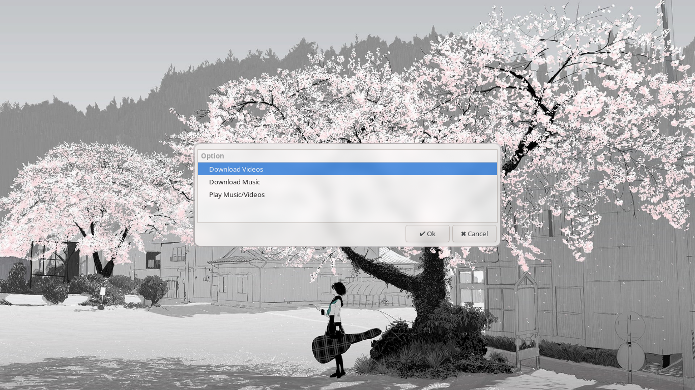
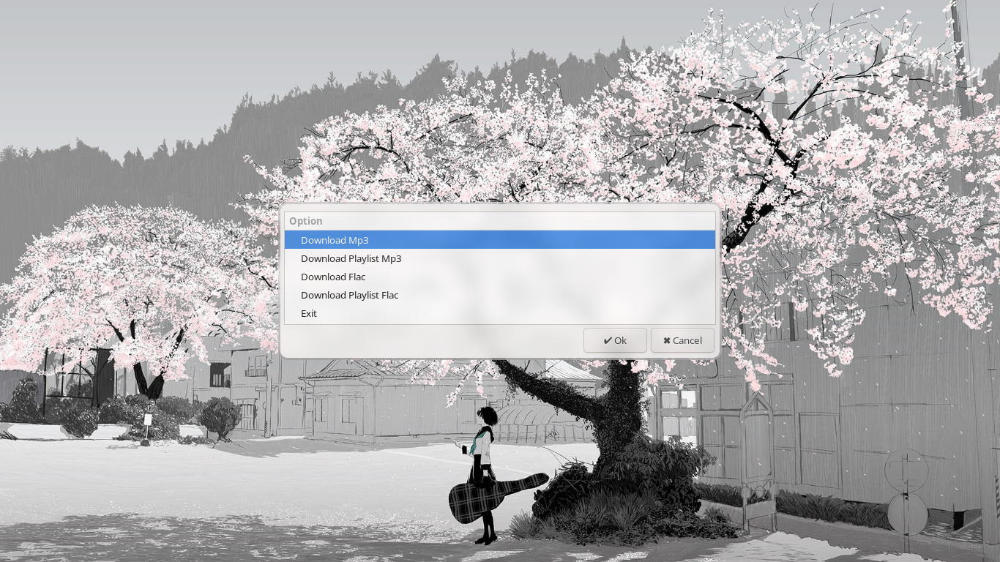
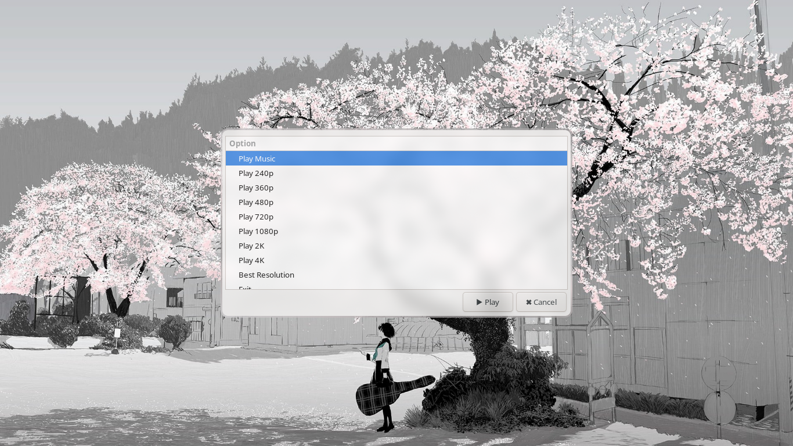
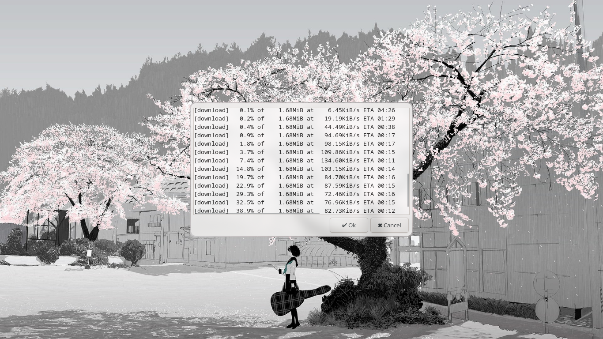

# 🎬 YouTube Downloader & Player (Bash + yad)  

[](https://www.gnu.org/software/bash/)
[](https://github.com/yt-dlp/yt-dlp)
[](./LICENSE)

> **Script created by Asep5K**


A lightweight Bash script with **yad menus** to download videos, music, or play content from YouTube. Supports playlists, multiple resolutions, and audio formats (MP3/FLAC).  

🔗 GitHub Repository: https://github.com/Asep5K/projek-yt

---

## ⚡ Features  

- Download videos in multiple resolutions: 240p → 4K, or best available.  
  > ⚠️ Note: I have not tested downloads above 1080p, so I cannot guarantee they work. Testing higher resolutions was not possible due to certain limitations.  
- Download audio only: MP3 or FLAC, single or playlist.  
- Play videos or audio directly with `mpv`.  
- Choose specific video/audio format for download.  
- yad-based interactive menu for easy navigation.  
- Desktop notifications for download/playback progress.  

---

## 🛠️ Requirements  

- `bash`  
- [`yt-dlp`](https://github.com/yt-dlp/yt-dlp)  
- [`mpv`](https://github.com/mpv-player/mpv)  
- [`yad`](https://github.com/v1cont/yad)  
- [`curl`](https://github.com/curl/curl) (for connectivity check)  
- `notify-send` (for desktop notifications)  
---

## 🚀 Installation & Usage

1. Install dependencies (choose your distro):
...

### Arch Linux  
```bash
sudo pacman -S --needed bash mpv yad curl libnotify python-pipx
pipx install yt-dlp
```
### Debian / Ubuntu
```bash
sudo apt update
sudo apt install bash mpv yad curl libnotify-bin pipx
pipx install yt-dlp
```
### Fedora
```bash
sudo dnf install bash mpv yad curl libnotify pipx
pipx install yt-dlp
```
### openSUSE
```bash
sudo zypper install bash mpv yad curl libnotify-tools pipx
pipx install yt-dlp
```
### Alternative (Manual Install from Source)
If you don’t want to use `pipx`, you can build [`yt-dlp`](https://github.com/yt-dlp/yt-dlp) from source

2. Clone the repository:
   ```bash
   git clone https://github.com/Asep5K/projek-yt.git
   cd projek-yt
   chmod +x yt.sh
   ./yt.sh
   ```

## 🎥 Demo & Screenshots

  
  
  
  
  
  

---
